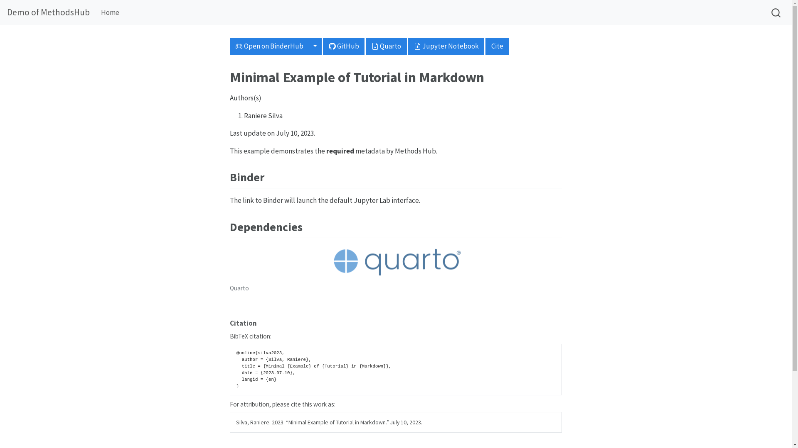

# MH Tutorial Preparation Guide (CSS)

## Accepted formats 

### With code execution

| Format | File extension | Notes |
| --- | --- | --- |
| [Quarto](https://quarto.org/) | `.qmd` | |
| [Jupyter Notebook Format](https://nbformat.readthedocs.io/en/latest/index.html) | `.ipynb` | Limited to a single programming language. |
| [R Markdown](https://rmarkdown.rstudio.com/) | `.rmd` | If possible, should be ported to Quarto. |

### Without code execution

For example, web tools.

| Format | File extension | Notes |
| --- | --- | --- |
| [Quarto](https://quarto.org/) | `.qmd` | Preferable format as it supports [citations](https://quarto.org/docs/authoring/footnotes-and-citations.html) and [cross references](https://quarto.org/docs/authoring/cross-references.html). |
| [(Pandoc) Markdown](https://pandoc.org/MANUAL.html#pandocs-markdown) | `.md` | |
| Microsoft Word | `.docx` | Not fully supported. |

## Headings

There are some suggested headings. See [`template.qmd`](template.qmd) for the suggested headings.

## Reproducibility



[image source](https://github.com/GESIS-Methods-Hub/andrew/blob/main/img/andrew-content.png)

All submitted tutorials will be converted to both `.html` and `.ipynb` by [magdalena](https://git.gesis.org/methods-hub/magdalena) [^1] using [Quarto](https://quarto.org/).

The `.html` version is used as the landing page on Methods Hub.

The `.ipynb` version is available for download from Methods Hub.

## Use the template

If you use the `quarto` template above, you can get both HTML (for preview) and `ipynb` by running:

```sh
quarto render template.qmd
```

## Conversion

Content converstion `magdalena` uses `quarto` to do the conversion. You can try the same conversion yourself.

`qmd` to `ipynb`

```sh
quarto convert input.qmd --output output.ipynb
```

`ipynb` to `qmd`

```sh
quarto convert input.ipynb --output output.qmd
```

See [`conv.sh`](conv.sh) on how to convert [an `ipynb`-based tutorial](https://github.com/gesiscss/css_methods_python/tree/main/b_data_collection_methods) to quarto and back.

## Binder compatibility

`quarto` can make your tutorial [Binder](https://mybinder.org) compatible. But you should have `_quarto.yml` in the same directory, i.e. it is a [quarto project](https://quarto.org/docs/projects/quarto-projects.html).

You can initialize a project by:

```sh
## replace `projectname` with something else
quarto create projectname
cd projectname
```

Suppose you have put your tutorial and its associated files in that directory.

```sh
quarto use binder
```

It will generate several files, e.g. `runtime.txt`, `postbuild`, `apt.txt`. You may still need to produce the [configuration files](https://mybinder.readthedocs.io/en/latest/using/config_files.html). For Python, you can use `requirements.txt` or `environment.yml` (conda). For R, you need to provide a file called `install.R` with `install.packages()` calls. In most of the cases, you do not need to pin the version (e.g. with tools such as `renv`) because [3PM](https://posit.co/products/cloud/public-package-manager/) is used. It will install the latest version of R packages according to the snapshot date recorded in `runtime.txt`.

You can check whether your tutorial is binder compatible by pushing your tutorial to GitHub (other options are also available) and launch it with [this form](https://mybinder.org/).

This is [an example](https://github.com/chainsawriot/methodshub-weat).

---

[^1]: Access to the code of magdalena is not public.
